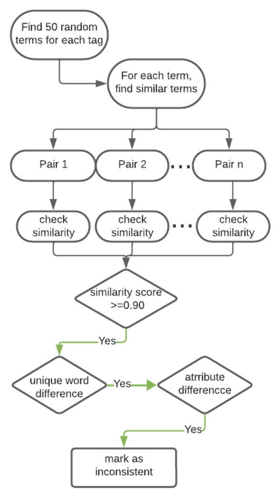
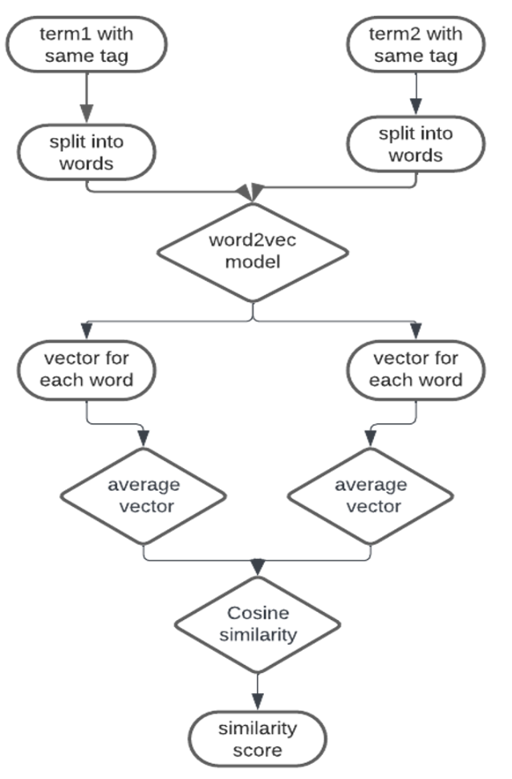
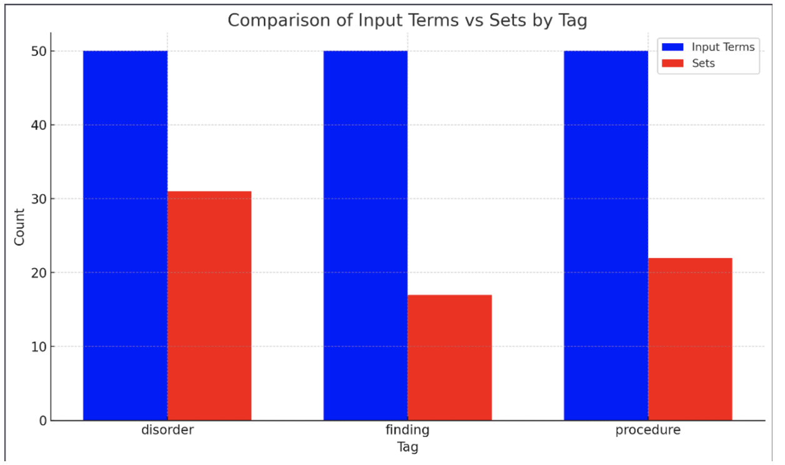
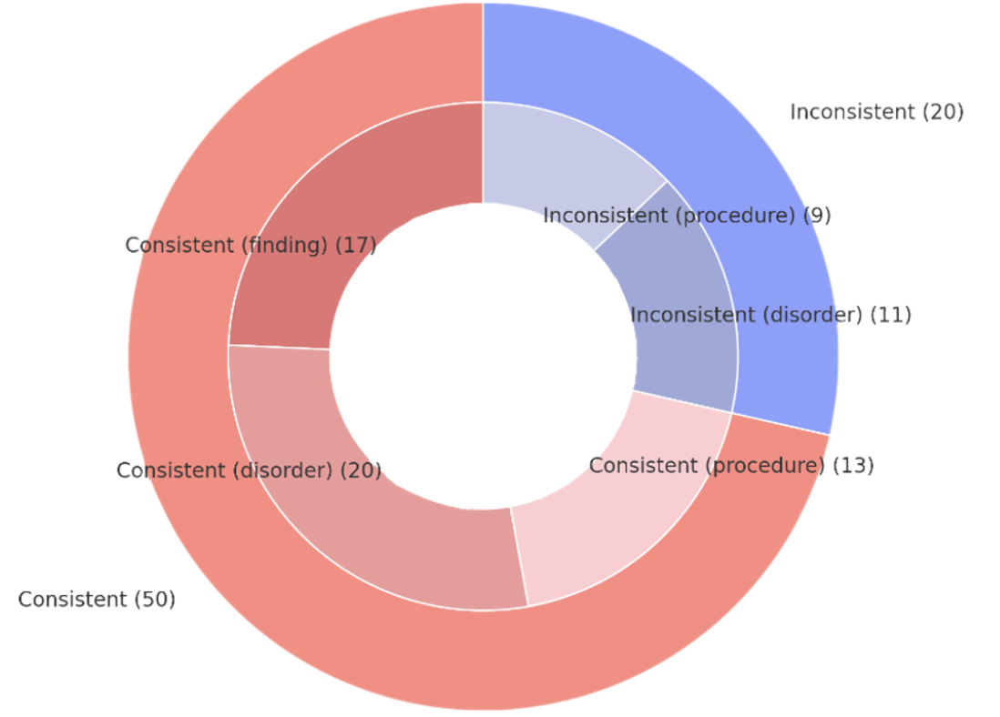

# Detecting Inconsistencies in the Modeling of SNOMED CT

**Author:** Emil Thomas Levin  
**Affiliation:** Department of Computer Science, Manhattan College, New York  
**Research Program:** KAKOS School of Science Summer Research  
**Advisor:** Dr. Ankur Agrawal  
**Date:** October 15, 2023

## Table of Contents
- [Introduction](#introduction)
- [Methodology](#methodology)
  - [The Similarity Algorithm](#the-similarity-algorithm)
- [Results](#results)
- [Discussion](#discussion)
- [Code](#explanation-of-code)
- [Conclusion](#conclusion)
- [References](#references)

## Introduction

SNOMED CT or Systemized Nomenclature of Medicine Clinical Terms stands as the world's most sophisticated and clinically accepted healthcare terminology. Regulated by SNOMED International, this multilingual repository is currently the gold standard in over eighty nations, showcasing its global influence. Regular bi-annual updates ensure its content remains timely and relevant, catering to the ever-evolving world of medicine.

Boasting more than 350,000 active concepts organized meticulously across nineteen high-level hierarchies, SNOMED CT is unparalleled in its depth and breadth. Each concept encapsulates a clinical meaning, linked to descriptive, human-readable terms. These concepts also form intricate webs of relationships, be it hierarchical or attribute-based, ensuring a comprehensive representation of each medical term. 

To illustrate, consider figure 1 below: 

The term "Myocardial infarction (disorder)" with its unique identifier 22298006 not only encompasses various descriptions like "Heart attack" but also intertwines with fourteen children concepts, four parent concepts, and intricate attribute relationships such as "Finding site” and “Associated morphology” linked to "Myocardium structure" and “Infarct.” 

However, with such vastness comes complexity. Inevitably, SNOMED CT is susceptible to inconsistencies, be it in the form of missing or incorrect relationships, attributes, or role groups. The literature is rich with studies that spotlight these inconsistencies, with methodologies varying from lexical feature analysis to tribal network abstraction networks [2-5]. Addressing these inconsistencies is paramount, making quality assurance a focal research area. Though manual audits offer precision, their laborious nature, as highlighted by Rector et al. [6], underscores the pressing need for automated, computational techniques to streamline the auditing process.

Building on prior research [8,9], this paper delves deeper into the fusion of sibling relationships and lexical techniques. Our intent is to magnify the precision in pinpointing inconsistencies while simultaneously reducing manual audit interventions. More than just identifying inconsistencies, our proposed method paints a comprehensive picture, offering contextual insights into modeling discrepancies. Beyond just quality assurance, our approach serves as a catalyst in uncovering inconsistencies in SNOMED CT concepts, thereby enriching its content.

To set the stage, let's delve into SNOMED CT, often touted as the "Google" for the medical community. In an era of relentless digital transformation, SNOMED CT stands tall as the universal language bridging the communication gap across healthcare systems worldwide.

## Methodology

The methodology outlined in this study is anchored in the July 2023 version of the International SNOMED CT. However, its design is versatile enough to be adaptable to other versions. At the core of our approach is the understanding that sibling concepts, which are lexically similar, should inherently display a congruency in their attribute modeling. This congruency pertains not only to the sheer number of attributes but also to the quality and nature of these attributes.

To elaborate, if we take two terms, say Term A and Term B, and categorize them as lexically similar, they should essentially mirror each other in their attribute composition. Any significant disparity in this attribute mapping indicates potential inconsistencies between the terms, which can have broader implications for the database's accuracy and utility.

Figure 2: Overall approach of methodology

The algorithm itself can be simplified in three main steps:

1. Sibling Concept Identification: The entirety of SNOMED CT's concepts are systematically paired. To qualify as a pair, two terms must exhibit a high degree of similarity — they must be of identical length and diverge by just a single word. An illustrative example of this criterion would be the pairing of the terms "Abnormality of right atrioventricular valve in double inlet ventricle (disorder)" and "Abnormality of left atrioventricular valve in double inlet ventricle (disorder)," where the only variation is the descriptors "right" and "left." From this vast pool, selections are made only for those pairs where both concepts have shared parents, thus deeming them as siblings.
  
2. Lexical Similarity Analysis: Using the word2vec algorithm, every sibling pair undergoes a lexical similarity test. A similarity score emerges from this process, with the metric spanning from 0 (complete dissimilarity) to 1 (absolute similarity). Our chosen threshold score is 0.9 to mark a pair as lexically similar.

3. Inconsistency Flagging: The final step scans for pairs where a disparity exists in the number of attribute relationships. Such pairs are flagged for inconsistencies and earmarked for a manual audit.

### The Similarity Algorithm

The crux of our approach lies in the algorithmic comparison of two SNOMED CT concept terms, yielding a similarity score reflective of their lexical resemblance. Utilizing word2vec—a two-layer neural network—our methodology harnesses the power of mapping words to distinct vectors. At its core, word2vec assimilates words to vectors based on context and relational analysis, ensuring that semantically similar terms correspond to similar vectors in a designated vector space.

Our corpus, a combination of PubMed and Wikipedia articles, feeds into this network. This rich corpus ensures that the generated vocabulary aligns well with SNOMED CT terminology and offers an accurate representation of inter-word relationships.

Figure 3: Overall approach of similarity calculation algorithm

Consider two concepts for comparison: Concept X and Concept Y (with the word count in X >= Y). After an initial preprocessing step where both concepts are converted to lowercase and devoid of their tags, each concept is broken down into individual words:

Concept X => [Z1, Z2, ..., Zn]

Concept Y => [z1, z2, ..., zm]

Each word from these concepts is transformed into its corresponding vector using our word2vec vocabulary, resulting in:

[Z1, Z2, ..., Zn] => [U1, U2, ..., Un]

[z1, z2, ..., zm] => [u1, u2, ..., um]

For both Concept X and Concept Y, we calculate the mean of their respective vector sets, yielding an average vector representation for each concept. With these average vector representations in hand for both concepts, we determine their similarity using Cosine similarity.  For words absent in the vocabulary, a score of 1 is assigned if the word appears in both concepts, otherwise, it gets a score of 0.

The final similarity score for the concept pair is the average of all individual word scores.

## Results

From the SNOMED CT database, we selected a random set of 50 terms from three distinct tags, disorder, procedure, and findings, culminating in a total of 150 terms. For these terms, our methodology successfully identified 70 sets of lexically similar terms, aggregating to 622 similar words as shown in Figure 4. This entails that for the 150 random input terms, almost half (70) had similar terms that could be grouped into sets.

Figure 4: Comparison of input terms to sets of similar terms found

Upon further assessment of these 70 sets for modeling inconsistencies, our approach flagged 20 sets as potentially inconsistent. Every single one of these 20 sets exhibited at least one attribute discrepancy when juxtaposed with their corresponding similar terms. This highlights potential areas of SNOMED CT that might benefit from manual auditing to ensure precision and consistency in modeling. The expectation is that these flagged sets contain attributes that are inconsistent and would warrant further scrutiny by experts.

Figure 5: Results of auditing

Figure 5 illustrates the ratio of terms for which we identified similar terms versus the total number of input terms, segmented by tag. Figure 5 contrasts the number of consistent versus inconsistent sets among the 70 sets, further stratified by tag.

## Discussion

The results emphasize the efficiency and reliability of our methodology in pinpointing inconsistencies within SNOMED CT's modeling. The algorithm offers a high probability of correctly identifying potential inconsistencies. 

One salient advantage of our approach is the contextual auditing capability. By contrasting similar concepts, potential discrepancies become discernible, enabling us to identify and rectify them effectively.

## Explanation of Code

This section provides an overview of the main functions used in each file, along with their descriptions and dependencies.

### main.py

1. **get_random_cids(filename, num=50)**
   - Description: Reads a file containing concept IDs (cids), extracts them, and returns a list of a specified number of randomly selected concept IDs.
   - Dependencies: None

2. **get_concepts_by_tag(filename, tag, num=100)**
   - Description: Reads a file containing concepts tagged with specific categories, filters them based on the provided tag, and returns a list of concept IDs.
   - Dependencies: None

3. **get_all_concepts_by_tag(filename, tag)**
   - Description: Retrieves all concepts tagged with a specific category, disregarding the limit.
   - Dependencies: None

4. **tag_equals(term, tag)**
   - Description: Extracts the tag from a concept term and compares it with the provided tag, returning True if they match, and False otherwise.
   - Dependencies: None

5. **generate_concept_files(tags, file_directory)**
   - Description: Generates concept files based on provided tags and a file directory. Processes concepts filtered by tag and writes the results to separate files.
   - Dependencies: Depends on functions `get_concepts_by_tag` and `get_all_concepts_by_tag`.

6. **validate_file_header(file_path, expected_header)**
   - Description: Validates the header of a file against an expected header. Raises an exception if the headers do not match.
   - Dependencies: None

7. **insert_data_from_file(cursor, table_name, file_path, expected_headers)**
   - Description: Inserts data from a file into a database table, given the cursor, table name, file path, and expected headers.
   - Dependencies: None

8. **is_table_empty(cursor, table_name)**
   - Description: Checks if a database table is empty by executing a count query using the cursor.
   - Dependencies: None

9. **populate_database()**
   - Description: Populates the database tables with data from specified files. Connects to the database, inserts data into tables, and commits the changes.
   - Dependencies: Depends on functions `insert_data_from_file` and `is_table_empty`.

### modeltrain.py

1. **modeltrain()**
   - Description: Trains a Word2Vec model using the provided input file containing text data. The trained model is then saved to the specified output file.
   - Dependencies: This function relies on the `gensim` library, particularly the `Word2Vec` class from `gensim.models`. It also uses the `re` module for regular expressions.

### similarity.py

1. **calculate_similarity2(model, vectors1, vectors2)**
   - Description: Calculates the similarity score between two sets of word vectors using cosine similarity.
   - Dependencies: This function uses the `numpy` library for array operations and the `scipy.spatial.distance` module for cosine similarity calculation.

2. **calculate_similarity(model, vectors1, vectors2)**
   - Description: Calculates the similarity score between two sets of word vectors by computing the cosine similarity between their mean vectors.
   - Dependencies: This function relies on the `numpy` library for array operations and the `scipy.spatial.distance` module for cosine similarity calculation.

3. **display_closestwords_tsnescatterplot(model, word)**
   - Description: Displays a t-SNE scatter plot for the closest words to the given word based on the Word2Vec model.
   - Dependencies: This function requires the `numpy`, `matplotlib.pyplot`, and `sklearn.manifold.TSNE` modules, along with the `gensim.models.Word2Vec` class.

4. **similarity()**
   - Description: Computes the similarity scores between two medical terms using word embeddings from a pre-trained Word2Vec model.
   - Dependencies: This function relies on the `gensim.models.KeyedVectors.load` method to load the Word2Vec model, as well as the `numpy` library for array operations.

5. **avg_of_max_similarity(vectors1, vectors2, model)**
   - Description: Calculates the average of the maximum similarity scores between each word vector of one term and all other word vectors of the other term.
   - Dependencies: This function utilizes the `numpy` library for array operations and the `scipy.spatial.distance.cosine` function for cosine similarity calculation.

6. **calculate_bidirectional_similarity(model, vectors1, vectors2)**
   - Description: Calculates the bidirectional similarity score between two sets of word vectors by considering the maximum similarity scores in both directions.
   - Dependencies: This function relies on the `numpy` library for array operations and the `scipy.spatial.distance.cosine` function for cosine similarity calculation.

7. **calculate_similarity3(vectors1, vectors2)**
   - Description: Calculates the similarity score between two sets of word vectors by finding unique vectors and then computing the cosine similarity.
   - Dependencies: This function depends on the `numpy` library for array operations and the `scipy.spatial.distance.cosine` function for cosine similarity calculation.

8. **contains_antonyms(words1, words2)**
   - Description: Checks if the given sets of words contain any antonym pairs.
   - Dependencies: This function does not have any external dependencies.

9. **split_term(term)**
   - Description: Splits a medical term into its constituent words and tag (if present).
   - Dependencies: This function relies on the `re` module for regular expression operations.

10. **compute_all_similarity_scores(term, similar_term, model)**
    - Description: Computes various similarity scores between two medical terms using word embeddings from a pre-trained Word2Vec model.
    - Dependencies: This function depends on the previously described `avg_of_max_similarity`, `calculate_bidirectional_similarity`, `calculate_similarity`, and `calculate_similarity3` functions, along with the `numpy` library for array operations.

11. **get_vectors(term, model)**
    - Description: Retrieves word vectors for the words in the given term using a pre-trained Word2Vec model.
    - Dependencies: This function depends on the `numpy` library for array operations and the `gensim.models.KeyedVectors` class for accessing word embeddings.

12. **combine_relationships(parents, groups)**
    - Description: Combines parent and group relationships into a single list.
    - Dependencies: This function does not have any external dependencies.

13. **check_common_parents(parents_1, parents_2, term1, term2)**
    - Description: Checks for common parents between two terms.
    - Dependencies: This function does not have any external dependencies.

14. **check_common_groups(groups_1, groups_2, term1, term2)**
    - Description: Checks for common groups and attributes between two terms.
    - Dependencies: This function does not have any external dependencies.

15. **audit_terms(max_score, words1, words2, parents_1, parents_2, groups_1, groups_2, term1, term2)**
    - Description: Performs an audit of the similarity between two terms and provides justification.
    - Dependencies: This function relies on the previously described `contains_antonyms`, `check_common_parents`, and `check_common_groups` functions.

16. **get_term(input)**
    - Description: Retrieves a term from the database based on user input (concept ID or term itself).
    - Dependencies: This function relies on the `databse` module for interacting with the database.

### findwords.py

1. **get_term_details(concept_id, term)**
   - Description: Retrieves the parents and attributes included in each group of a term from a database.
   - Dependencies: Relies on functions from the `databse` module to retrieve information from the database.

2. **audit_terms2(concept_id_term1, concept_id_similar_term, term1_details, similar_term_details, term1, similar_term, similarity_score)**
   - Description: Audits the details of two terms and computes a result based on their similarities.
   - Dependencies: Requires functions from the `similarity` module to calculate similarity scores and compare word vectors.

3. **process_selected_terms(terms, n=50)**
   - Description: Processes a list of terms, finding similar terms for each and writing the results to a file.
   - Dependencies: Utilizes functions from the `databse`, `similarity`, and `filter_terms` modules for database operations, similarity calculations, and term filtering, respectively.

4. **process_core(cids, tcon, filepath)**
   - Description: Processes a list of concept IDs, finding similar terms for each and writing the results to a file.
   - Dependencies: Relies on functions from the `databse`, `similarity`, and `filter_terms_beta` modules for database operations, similarity calculations, and term filtering, respectively.

5. **process_selected_integers()**
   - Description: Processes a list of integers corresponding to concept IDs, finding similar terms for each and writing the results to a file.
   - Dependencies: Depends on functions from the `databse`, `similarity`, and `filter_terms_by_constraints` modules for database operations, similarity calculations, and term filtering, respectively.

6. **filter_terms(term, similar_terms, model)**
   - Description: Filters similar terms based on their cosine similarity score with the input term.
   - Dependencies: Requires functions from the `similarity` module to calculate similarity scores and compare word vectors.

7. **filter_terms_beta(term, similar_terms, model)**
   - Description: Another version of the function to filter similar terms based on their cosine similarity score with the input term.
   - Dependencies: Also requires functions from the `similarity` module to calculate similarity scores and compare word vectors.

8. **get_majority_details(filtered_details, threshold_ratio=0.5)**
   - Description: Determines the majority attributes and groups among a list of filtered term details.
   - Dependencies: None.

9. **audit_majority_details(concept_id_term, original_term_details, majority_details, term)**
   - Description: Audits the majority details of a term and computes a result based on their similarities.
   - Dependencies: None.

10. **filter_terms_by_constraints(term, filtered_similar_terms)**
    - Description: Filters similar terms based on constraints such as word length and tag.
    - Dependencies: None.

11. **adjust_target_values(term, missing_attributes)**
    - Description: Adjusts the target values of missing attributes based on the unique words in the term.
    - Dependencies: None.

12. **check_common_attributes(term1_details, similar_term_details)**
    - Description: Checks for common attributes between two terms.
    - Dependencies: None.

13. **common_parents_count(term_details_1, term_details_2)**
    - Description: Counts the number of common parents between two sets of term details.
    - Dependencies: None.

14. **check_common_attributes_v3(term1_details, term2_details)**
    - Description: Checks for common attributes between two terms, considering the attributes' names and counts.
    - Dependencies: None.

15. **process_selected_integersv2()**
    - Description: Processes a list of integers corresponding to concept IDs, finding similar terms for each and writing the results to a file, with additional similarity score computations.
    - Dependencies: Depends on functions from the `databse`, `similarity`, and `filter_terms_by_constraints` modules for database operations, similarity calculations, and term filtering, respectively.

16. **check_attribute_count(term_details, similar_term_details, result)**
    - Description: Checks if the number of attributes in the similar term matches that of the original term and if the result is valid.
    - Dependencies: None.

## Conclusion

In an era where SNOMED CT stands as an indispensable global standard for encoding healthcare data, the introduction of our computational method marks a significant stride in healthcare informatics. This technique efficiently pinpoints inconsistencies, drastically reducing the need for labor-intensive manual audits. Beyond mere error identification, our method provides a dual benefit by also revealing and addressing inconsistencies in SNOMED CT. Implementing such advanced quality assurance strategies is paramount in fortifying ongoing endeavors to uphold and enhance the content quality of SNOMED CT, ensuring its continued reliability and comprehensive utility in the healthcare domain.

## References

1. [word2vec Tools - Bio.nlplab.org](https://bio.nlplab.org/#word-vector-tools)
2. [SNOMED International](https://www.snomed.org)
3. Agrawal, Ankur, and Kashifuddin Qazi. “Quality Assurance of SNOMED CT Using Lexical Similarity and Sibling Relationships.” ICMHI  2023, Kyoto, Japan, May 12-14, 2023.
4. A. Agrawal, G. Elhanan, and M. Halper, "Dissimilarities in the Logical Modeling of Apparently Similar Concepts in SNOMED CT," AMIA Annu Symp Proc, vol. 2010, pp. 212-6, Nov 2010.
5. "word2vec." Google Code. [https://code.google.com/archive/p/word2vec/](https://code.google.com/archive/p/word2vec/) (accessed August 24, 2023).
6. "SNOMED CT Browser." SNOMED International. [http://browser.ihtsdotools.org](http://browser.ihtsdotools.org) (accessed August 24, 2023).
7. L. Cui et al., "Auditing SNOMED CT hierarchical relations based on lexical features of concepts in non-lattice subgraphs," J Biomed Inform, vol. 78, pp. 177-184, Feb 2018.
8. C. Ochs et al., "A tribal abstraction network for SNOMED CT target hierarchies without attribute relationships," J Am Med Inform Assoc, vol. 22, no. 3, pp. 628-39, May 2015.
9. A. L. Rector et al., "Getting the foot out of the pelvis: modeling problems affecting use of SNOMED CT hierarchies in practical applications," J Am Med Inform Assoc, vol. 18, no. 4, pp. 432-40, Jul-Aug 2011.
10. A. Agrawal and K. Qazi, "Detecting modeling inconsistencies in SNOMED CT using a machine learning technique," Methods, vol. 179, pp. 111-118, Jul 2020.
11. L. Zheng et al., "Training a Convolutional Neural Network with Terminology Summarization Data Improves SNOMED CT Enrichment," AMIA Annu Symp Proc, vol. 2019, pp. 972-981, 2019.
12. F. Zheng, R. Abeysinghe, and L. Cui, "Identification of missing concepts in biomedical terminologies using sequence-based formal concept analysis," BMC Med Inform Decis Mak, vol. 21, no. Suppl 7, p. 234, Sep 2021.

